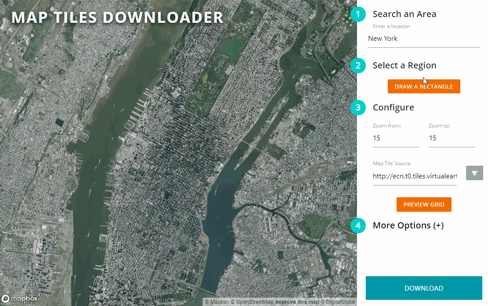

# 地图瓦片下载工具

> [原项目地址](https://github.com/AliFlux/MapTilesDownloader)

**一个超级简单的GUI地图瓦片下载器**

<p align="center">
  
</p>

## 用法

### 依赖

1. **python3.6+**

2. src下有三种不同的server可供选择, 他们的依赖不同:

    1. thread_server: `pip install pillow`

    2. sanic_server: `pip install sanic tornado aiofile`

    3. tornado_server: `pip install tornado aiofile`

### 使用

1. 启动server

    1. thread_server: `python thread_server`

    2. sanic_server: `python sanic_server`

    3. tornado_server: `python tornado_server`

2. 然后打开`http://localhost:8080`

有什么不同?

> thread_server 在每一个请求进来的时候创建一个线程, 越下载越慢..
>
> sanic_server/tornado_server 在处理下载和文件存放的时候都是用了Python异步IO的特性, 丝滑顺畅

### 注意事项

如果你想要批量下载, 开启多线程, 不要使用Chrome浏览器去下载, 详见[这里](https://community.sanicframework.org/t/blocking-request/578)

### 进阶操作

1. sanic_server支持多个worker, 只要打开workers的注释即可, 不要开太多把自己电脑搞崩了

2. 添加地图源, 在`UI/main.js`的sources下添加源, 只要源url里面有`x`, `y`, `z`,`quad` 的就行

### docker启动

```sh
docker run -v $PWD/output:/app/output/ -p 8080:8080 -it
```

### 已知问题

- 前段页面的性能较差, 多线程下载的时候容易卡

- 不兼容百度地图, 好像是应为百度地图的坐标系和其他的不一样

## 特点(原文翻译)

- 炒鸡简单的地图选取!
- 多线程下载!
- 跨平台!
- docker支持!
- 支持2x分辨率(我没试过)!
- 支持下到mbtile的格式文件(我没试过)!
- 支持多级缩放选取!
- 瓦片文件不会重复下载!
- 支持自定义文件名保存!
- 支持**任何**地图瓦片供应商, 只要是url里面有x,y,z,或者quad!
- 感谢MapBox老铁支持!

## 许可

This software is released under the [MIT License](LICENSE). Please read LICENSE for information on the
software availability and distribution.

Copyright (c) 2020 [Ali Ashraf](http://aliashraf.net)